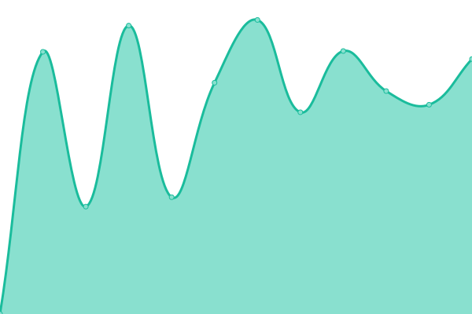

# [📈 Live Status](https://demo.upptime.js.org): <!--live status--> **🟩 All systems operational**

This repository contains the open-source uptime monitor and status page for [Upptime](https://upptime.js.org), powered by [Upptime](https://github.com/upptime/upptime).

With [Upptime](https://upptime.js.org), you can get your own unlimited and free uptime monitor and status page, powered entirely by a GitHub repository. We use [Issues](https://github.com/upptime/upptime/issues) as incident reports, [Actions](https://github.com/fjoker/upptime/actions) as uptime monitors, and [Pages](https://demo.upptime.js.org) for the status page.

<!--start: status pages-->
<!-- This summary is generated by Upptime (https://github.com/upptime/upptime) -->
<!-- Do not edit this manually, your changes will be overwritten -->
<!-- prettier-ignore -->
| URL | Status | History | Response Time | Uptime |
| --- | ------ | ------- | ------------- | ------ |
|  [www](https://www.eduwill.net) | 🟩 Up | [www.yml](https://github.com/fjoker/upptime/commits/HEAD/history/www.yml) | 

 1558ms
     
 | 

<a href="https://fjoker.github.io/upptime/history/www">100.00%</a>
    

|  [arch](https://arch.eduwill.net) | 🟩 Up | [arch.yml](https://github.com/fjoker/upptime/commits/HEAD/history/arch.yml) | 

 1735ms
     
 | 

<a href="https://fjoker.github.io/upptime/history/arch">100.00%</a>
    

|  [ea](https://ea.eduwill.net) | 🟩 Up | [ea.yml](https://github.com/fjoker/upptime/commits/HEAD/history/ea.yml) | 

 2033ms
     
 | 

<a href="https://fjoker.github.io/upptime/history/ea">100.00%</a>
    

<!--end: status pages-->

[**Visit our status website →**](https://demo.upptime.js.org)

## 📄 License

- Code: [MIT](./LICENSE) © [Upptime](https://upptime.js.org)
- Data in the `./history` directory: [Open Database License](https://opendatacommons.org/licenses/odbl/1-0/)
